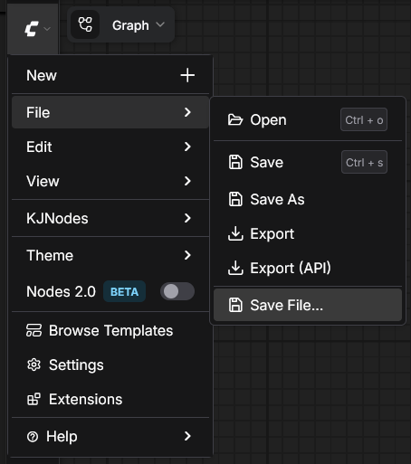

# ComfyUI-SaveFile

Adds a **"Save File…"** option to the **File** menu that opens a native OS save dialog, letting you choose exactly where to save your workflow JSON.




## Why not just Export?

ComfyUI's built-in **Export** saves the workflow to your browser's default Downloads folder. **Save File…** opens a **native OS file dialog** instead, so you can pick any location on your drive — no need to move files manually after saving.

## Features

- **Native OS save dialog** — choose exactly where to save, not just Downloads
- Saves the current workflow as a `.json` file
- Preserves canvas view state (zoom/offset) if enabled in settings
- Falls back to a standard browser download in Firefox

## Installation

### Option 1: Manual

1. Navigate to your `ComfyUI/custom_nodes/` directory
2. Clone or copy this repository:
   ```bash
   cd ComfyUI/custom_nodes
   git clone https://github.com/hadoooooouken/ComfyUI-SaveFile.git
   ```
3. Restart ComfyUI

### Option 2: Download ZIP

1. Download this repository as a ZIP
2. Extract the `ComfyUI-SaveFile` folder into `ComfyUI/custom_nodes/`
3. Restart ComfyUI

## Usage

1. Open ComfyUI
2. Click the **☰ menu** → **File** → **Save File…**
3. Choose where to save and click Save

## Browser Compatibility

| Browser | Behavior |
|---------|----------|
| Chrome / Edge | ✅ Native "Save As" dialog |
| Electron (Desktop) | ✅ Native "Save As" dialog |
| Firefox / Safari | ⚠️ Standard browser download (see below) |

### Firefox Users

Firefox does not support the [File System Access API](https://developer.mozilla.org/en-US/docs/Web/API/Window/showSaveFilePicker), so the extension falls back to a regular file download. By default, Firefox saves to your Downloads folder without asking.

**To get a save dialog in Firefox:**

1. Open Firefox **Settings** (`about:preferences`)
2. Scroll to **Files and Applications → Downloads**
3. Enable **✅ Always ask you where to save files**

With this setting, Firefox will prompt you to choose a save location every time — similar to the native dialog in Chrome.

## License

MIT
